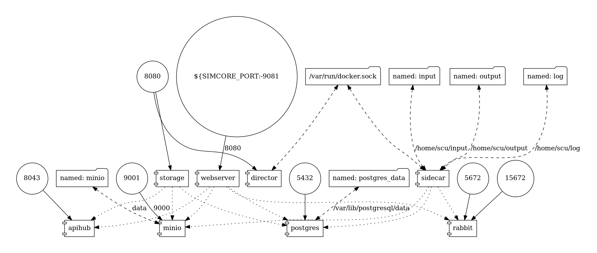

# osparc-simcore platform

**WARNING** This application is **still under development**.

<!-- NOTE: when branched replace `master` in urls -->
[`master`](https://github.com/itisfoundation/osparc-simcore/tree/master)
[![Requires.io]](https://requires.io/github/ITISFoundation/osparc-simcore/requirements/?branch=master "State of third party python dependencies")
[![travis-ci]](https://travis-ci.org/ITISFoundation/osparc-simcore "State of CI: build, test and pushing images")
[![coverals.io]](https://coveralls.io/github/ITISFoundation/osparc-simcore?branch=master "Test coverage")
[![github.io]](https://itisfoundation.github.io/)
[![itis.dockerhub]](https://hub.docker.com/u/itisfoundation)


<!-- THIS SERVICE MALFUNCTIONS
[![webserver]](https://microbadger.com/images/itisfoundation/webserver "More on itisfoundation/webserver:staging-latest image")
[![director]](https://microbadger.com/images/itisfoundation/director "More on itisfoundation/director:staging-latest image")
[![sidecar]](https://microbadger.com/images/itisfoundation/sidecar "More on itisfoundation/sidecar:staging-latest image")
[![storage]](https://microbadger.com/images/itisfoundation/storage "More on itisfoundation/storage:staging-latest image")
-->


<!-- ADD HERE ALL BADGE URLS -->
[Requires.io]:https://img.shields.io/requires/github/ITISFoundation/osparc-simcore.svg
[travis-ci]:https://travis-ci.org/ITISFoundation/osparc-simcore.svg?branch=master
[coverals.io]:https://coveralls.io/repos/github/ITISFoundation/osparc-simcore/badge.svg?branch=master
[github.io]:https://img.shields.io/website-up-down-green-red/https/itisfoundation.github.io.svg?label=documentation
[itis.dockerhub]:https://img.shields.io/website/https/hub.docker.com/u/itisfoundation.svg?down_color=red&label=dockerhub%20repos&up_color=green
[webserver]:https://img.shields.io/microbadger/image-size/itisfoundation/webserver/staging-latest.svg?label=webserver&style=flat
[director]:https://img.shields.io/microbadger/image-size/itisfoundation/director/staging-latest.svg?label=director&style=flat
[sidecar]:https://img.shields.io/microbadger/image-size/itisfoundation/sidecar/staging-latest.svg?label=sidecar&style=flat
[storage]:https://img.shields.io/microbadger/image-size/itisfoundation/storage/staging-latest.svg?label=storage&style=flat
<!---------------------------->

## Overview


A graph view of services, ports, volumes and service dependencies:


## Usage

```bash
  # clone repo
  git clone https://github.com/ITISFoundation/osparc-simcore.git
  cd osparc-simcore

  # show setup info and build core services
  make info build

  # starts swarm and deploys services
  make up-prod

  # display swarm configuration
  make info-swarm

  # open browser in:
  #  localhost:9081 - simcore front-end site
  #
  xdg-open http://localhost:9081/

  # stops
  make down
```

## Requirements

To build and run:

- docker
- make >=4.2
- awk, jq (optional tools within makefiles)

To develop, in addition:

- python 3.6 (this dependency will be deprecated soon)
- nodejs for client part (this dependency will be deprecated soon)
- [vscode] (highly recommended)

This project works and is developed mainly under **linux** but, with some adjustments, it can also be done under windows (see notes below).

##### Setup for **windows**

In windows, it works under [WSL] (windows subsystem for linux). Some details on the setup:

- [Install](https://chocolatey.org/docs/installation) [chocolatey] package manager
  - ``choco install docker-for-windows``
  - ``choco install wsl`` or using [instructions](https://docs.microsoft.com/en-us/windows/wsl/install-win10)
-  Follow **all details** on [how to setup flawlessly](https://nickjanetakis.com/blog/setting-up-docker-for-windows-and-wsl-to-work-flawlessly) docker for windows and [WSL]


## Releases

- [Git release workflow](ops/README.md)
- Public [releases](https://github.com/ITISFoundation/osparc-simcore/releases)
- Production in https://osparc.io
- [Staging instructions](docs/staging-instructions.md)


<!-- ADD REFERENCES BELOW AND KEEP THEM IN ALPHABETICAL ORDER -->
[chocolatey]:https://chocolatey.org/
[vscode]:https://code.visualstudio.com/
[WSL]:https://docs.microsoft.com/en-us/windows/wsl/faq
