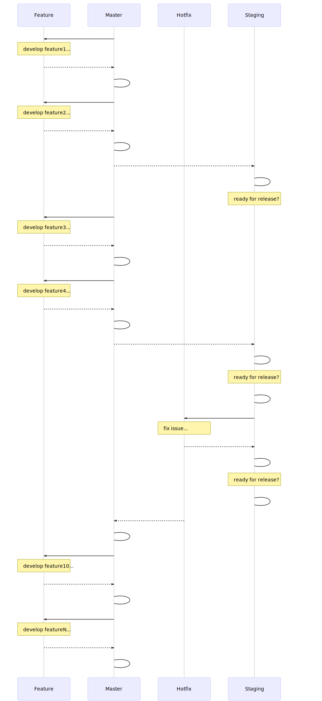

# Continuous Integration

## Travis / Dockerhub setup

The osparc-simcore repository provides a Travis-CI [recipe](.travis.yml) that fullfills the [Release Workflow](docs/img/git-release-workflow.svg).

To this end Travis should be enabled for the repository in each fork and a [Dockerhub](https://hub.docker.com/) account is recommended to push the docker images generated by Travis.

Configuring your travis settings will speed up the travis CI process by making use of Dockerhub (or another docker registry) to move docker images between stages.

### Travis configuration

Define the following secure environment variables in your fork:

```bash
DOCKER_REGISTRY # this shall be set to your own dockerhub repository account for example: itisfoundation
DOCKER_USERNAME # the docker username (!beware this should be a [secure env variable](https://docs.travis-ci.com/user/environment-variables/#defining-encrypted-variables-in-travisyml))
DOCKER_PASSWORD # the docker password (!beware this should be a [secure env variable](https://docs.travis-ci.com/user/environment-variables/#defining-encrypted-variables-in-travisyml))
```

### Release workflow


