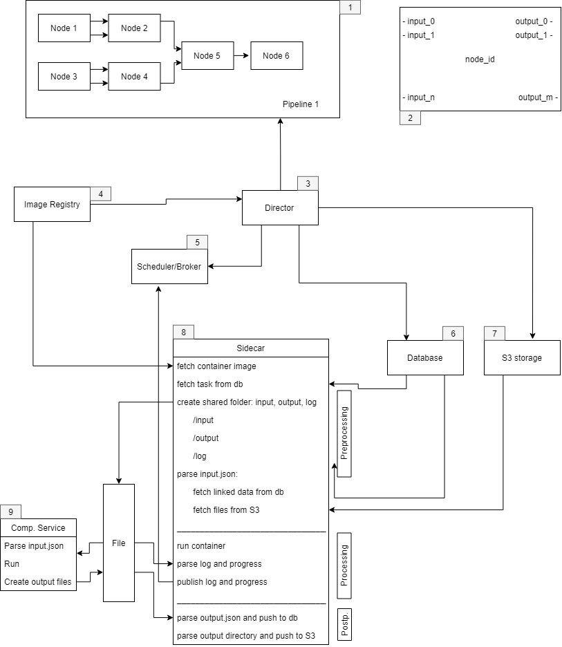

# Computational Backend for simcore

## Overview
The following diagram describes in detail the design of the computational backend.
This is the part of the platform that evaluates non-interacting interdependent tasks that are described as directed acyclic graphs (dag).



## Details

### 1. Computational pipeline

A computational pipeline consists of several nodes interconnected with each other by directed arrows (links).
Every nodes represents a computational service that is implemented as a docker image.
All services with their settings can be queried from the frontend via the director.
The data structure for a computational pipeline is defined via the data structure for every containing node plus additional information for links.
If an input consists of a file, the user can upload directly to the S3 storage via a pre-signed link provided by the director.

### 2. Nodes

All nodes are described with the following data structure:

```json
{
  "project_id" : uid,
  "node_id" : uid,
  "image" : {
    "name" : dockerregistry.module.name
    "tag"  : 1.0},
  "inputs": [{
    "key": "in_1",
    "label": "Filename",
    "desc": "What is this file doing",
    "type": "file-url",
    "value": null,
    "required": True}, {
    "key": "in_2",
    "label": "N",
    "desc": "Value for N",
    "type": "value",
    "value": null,
    "required": False}]
  "settings":  [{
    "Ram usage" : number,
    "Hardware req." : gpu}]
  "outputs": [{
    "key": "out_1",
    "label": "File-url",
    "desc": "File-url",
    "type": "file-url",
    "value": null},{
    "key": "out_2",
    "label": "Number",
    "desc": "Number",
    "type": "number",
    "value": null}],
}
```

This data structure is attached to every container image an can be queried from the frontend via the director.
Every node has a unique id and belongs to a unique pipeline.
The image data define the docker image to be used.
All input ports can be defined via an input port from a preceding node or directly via user input.
Settings are independent of input port and can be editable.
Input ports can be required or optional.
If there is any logic that restricts possible output ports depending on the input ports, this information must be encoded into this data structure (json logic)
The data structure also defines whether a preceding output port can be attached to a input port.

### 3. Director

The director parses the pipeline from the frontend and converts it into a graph.
Two tables are created, one to represent the dag and one to represent every node.
Every link to an node A is represented as follows:

``
project_id.nodeA_id.key
``

This handles the case of files and values.
Finally the director schedules the dag via the scheduler/broker.
The director can pass information about log/progress to the frontend.

### 4. Image registry

Contains the complete list of all available computational services together with meta data containing version and input/output data structure.

### 5. Scheduler/Broker

Takes care of distributing independent parts of the pipeline on remote workers.
Makes sure jobs are restarted in case of errors.
Handles channels for publish/subscribe used by sidecars to publish logs/progress.

### 6. DB

Stores pipelines and nodes. Updates input/output on the fly.

### 7. S3

Cluster storage for input files and intermediate results.

### 8. Sidecar

Handles the execution of one node in the pipeline. Consists of three stages:

***Preprocessing***

- Fetch container image (cached)
- Get current task from db
- Create shared folders for input, output and log
- Parse input data structure, fetch data from S3 or db if necessary

***Processing***

- Start container
- Parse output and log and publish via broker

***Postprocessing***

- Parse output directory
- Push to S3 or db if necessary

### 9. Comp. service

Ephemeral one-shot container that runs one computational service.
Data is written to and read from shared folders with sidecar.
