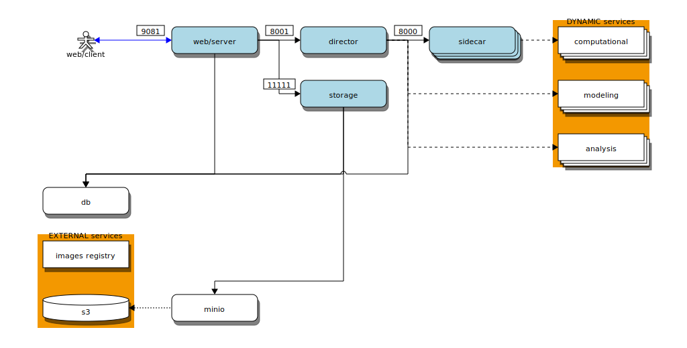
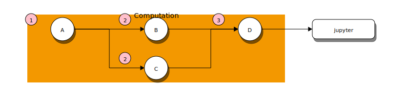
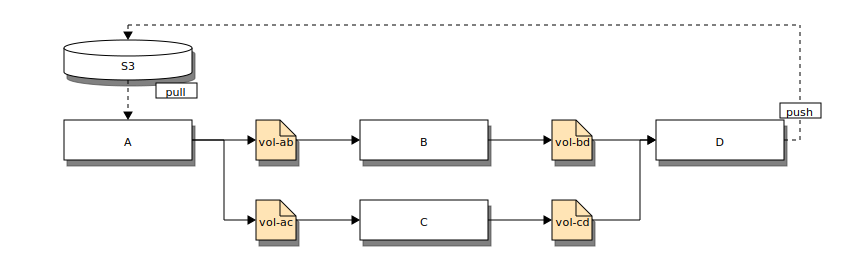

# Architecture diagrams

Below some diagrams that describe the architecture and design workflow of [simcore]

## Services Interaction

[](http://interactive.blockdiag.com/?compression=deflate&src=eJx9Uj1vwjAQ3fsrLM-BgrpQpUFClKFqy9B2aIUYLvYRLJw4sk0RqvjvtZ0PEqjqIXLO7727d3epVGzHBWTk54YQpvJyb8EKVYAkK2OB7ZBHRDBVkIRQIzgy0MOyyOg6doRccZSiyFpsiB6U3qHux8ApHo0w_SgXGplV2t_pAdNbg_obNW3_mRRYWOpYWygxAQ-umGnAiBwyNERjJozVx0A0dw2cbqQ6sC1oO-RgIQWDvm6HybTal8GzPxJSlN7g49dy9vo0J74MwdAEPX96nYlb33HrK65dB8LJfZokVY6QIaHvH7P586V613jUtiSqLZ5cuWehWmfx-bF4W85ezlL-8bobJBeFUJFrSUjlOvMwmFZBstooyf10jT1KTLiytppKnbQ_AM_rFkpWVSn3o8k4cu2RSiep3OP6cpTEERtPDWkyGo178w-gtK7oSmIw7b-1LF9UvWzudrW9zpYbKgez_YvY3d3_kd3dvUCefgHHBgo7)

## Data Management Among Computational Services

Sample of computational pipeline in the workbench connected to an jupyter node to perform interactively some analysis on the results. Every circle represents some
computation node and the numbers the order of execution.

This pipeline is mapped into a computational services pipeline

[simcore]:https://github.com/ITISFoundation/osparc-simcore
