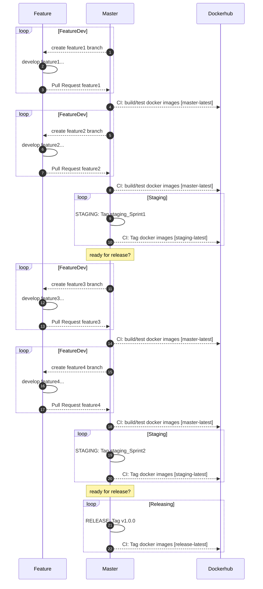
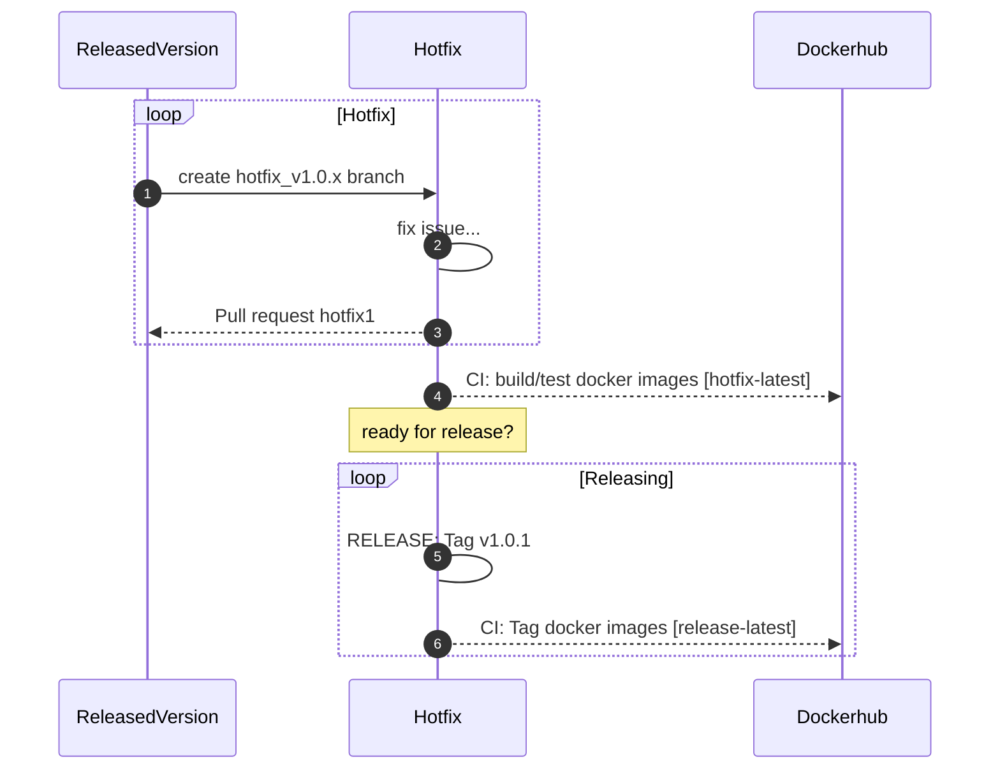

# create SVG out of this schema

[mermaid live editor](https://mermaidjs.github.io/mermaid-live-editor)

Release process

```mermaid
sequenceDiagram
autonumber
participant Feature
participant Master
participant Dockerhub

Loop FeatureDev
  Master-->>Feature: create feature1 branch
  Feature->Feature: develop feature1...
  Feature-->>Master: Pull Request feature1
end
Master-->>Dockerhub: CI: build/test docker images [master-latest]

Loop FeatureDev
  Master-->>Feature: create feature2 branch
  Feature->Feature: develop feature2...
  Feature-->>Master: Pull Request feature2
end
Master-->>Dockerhub: CI: build/test docker images [master-latest]

Loop Staging
  Master->Master: STAGING: Tag staging_Sprint1
  Master-->>Dockerhub: CI: Tag docker images [staging-latest]
end
Note over Master: ready for release?

Loop FeatureDev
  Master-->>Feature: create feature3 branch
  Feature->Feature: develop feature3...
  Feature-->>Master: Pull Request feature3
end
Master-->>Dockerhub: CI: build/test docker images [master-latest]

Loop FeatureDev
  Master-->>Feature: create feature4 branch
  Feature->Feature: develop feature4...
  Feature-->>Master: Pull Request feature4
end
Master-->>Dockerhub: CI: build/test docker images [master-latest]

Loop Staging
  Master->Master: STAGING: Tag staging_Sprint2
  Master-->>Dockerhub: CI: Tag docker images [staging-latest]
end
Note over Master: ready for release?

Loop Releasing
  Master->Master: RELEASE: Tag v1.0.0
  Master-->>Dockerhub: CI: Tag docker images [release-latest]
end
```

Hotfix process

```mermaid
sequenceDiagram
autonumber
participant ReleasedVersion
participant Hotfix

Loop Hotfix
  ReleasedVersion->>Hotfix: create hotfix_v1.0.x branch
  Hotfix->Hotfix: fix issue...
  Hotfix-->>ReleasedVersion: Pull request hotfix1
end
Hotfix-->>Dockerhub: CI: build/test docker images [hotfix-latest]
Note over Hotfix: ready for release?
Loop Releasing
  Hotfix->Hotfix: RELEASE: Tag v1.0.1
  Hotfix-->>Dockerhub: CI: Tag docker images [release-latest]
end
```
