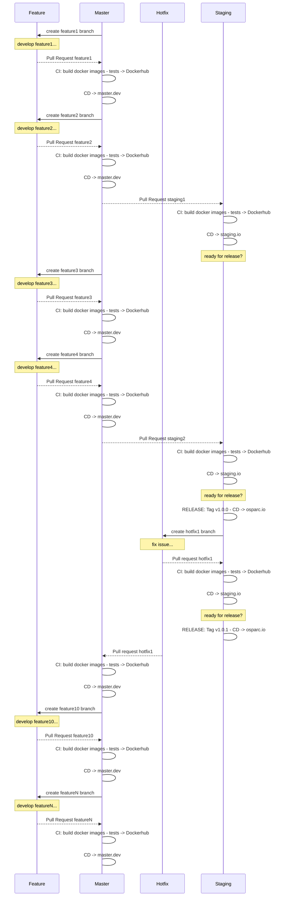

```mermaid
sequenceDiagram
participant Feature
participant Master
participant Hotfix
participant Staging

Master->>Feature: create feature1 branch
Note over Feature: develop feature1...
Feature-->>Master: Pull Request feature1
Master->Master: CI: build docker images - tests -> Dockerhub
Master->Master: CD -> master.dev

Master->>Feature: create feature2 branch
Note over Feature: develop feature2...
Feature-->>Master: Pull Request feature2
Master->Master: CI: build docker images - tests -> Dockerhub
Master->Master: CD -> master.dev

Master-->>Staging: Pull Request staging1
Staging->Staging: CI: build docker images - tests -> Dockerhub
Staging->Staging: CD -> staging.io
Note over Staging: ready for release?

Master->>Feature: create feature3 branch
Note over Feature: develop feature3...
Feature-->>Master: Pull Request feature3
Master->Master: CI: build docker images - tests -> Dockerhub
Master->Master: CD -> master.dev

Master->>Feature: create feature4 branch
Note over Feature: develop feature4...
Feature-->>Master: Pull Request feature4
Master->Master: CI: build docker images - tests -> Dockerhub
Master->Master: CD -> master.dev

Master-->>Staging: Pull Request staging2
Staging->Staging: CI: build docker images - tests -> Dockerhub
Staging->Staging: CD -> staging.io
Note over Staging: ready for release?
Staging->Staging: RELEASE: Tag v1.0.0 - CD -> osparc.io

Staging->>Hotfix: create hotfix1 branch
Note over Hotfix: fix issue...
Hotfix-->>Staging: Pull request hotfix1
Staging->Staging: CI: build docker images - tests -> Dockerhub
Staging->Staging: CD -> staging.io
Note over Staging: ready for release?
Staging->Staging: RELEASE: Tag v1.0.1 - CD -> osparc.io
Hotfix-->>Master: Pull request hotfix1
Master->Master: CI: build docker images - tests -> Dockerhub
Master->Master: CD -> master.dev

Master->>Feature: create feature10 branch
Note over Feature: develop feature10...
Feature-->>Master: Pull Request feature10
Master->Master: CI: build docker images - tests -> Dockerhub
Master->Master: CD -> master.dev

Master->>Feature: create featureN branch
Note over Feature: develop featureN...
Feature-->>Master: Pull Request featureN
Master->Master: CI: build docker images - tests -> Dockerhub
Master->Master: CD -> master.dev
```
