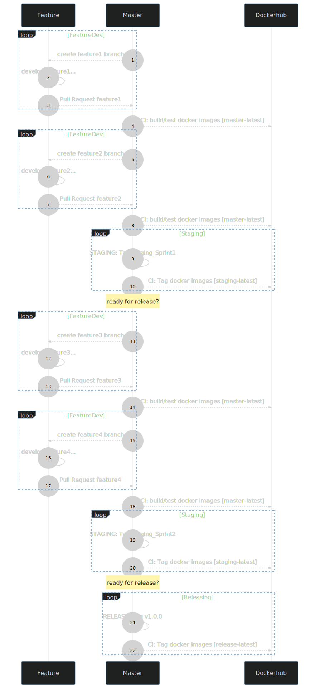
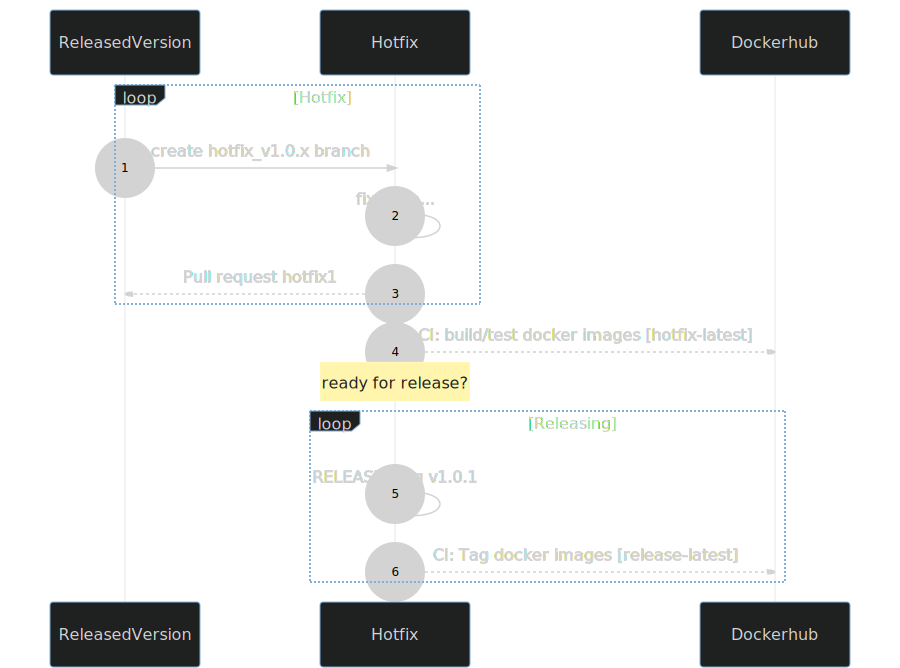

# Management of releases of simcore

The process of creating staging/release/hotfix versions of code from [Master](https://github.com/ITISFoundation/osparc-simcore/tree/master) is described here.

## Description

Each commit on the *master* branch triggers a CI workflow that builds the simcore platform docker images.
These docker images are then stored on [dockerhub](https://hub.docker.com/repositories/itisfoundation) registry in the itisfoundation [repository](https://hub.docker.com/repositories/itisfoundation).
Each docker image are named with the following pattern:

- ``itisfoundation/[image_name]:master-[CINAME]-latest``
- ``itisfoundation/[image_name]:master-[CINAME]-[BUILD_DATE]--[BUILD_TIME].[GIT_SHA]``

with:

- ``CINAME`` the name of the CI
- ``BUILD_DATE`` is the build date
- ``BUILD_TIME`` is the build time
- ``GIT_SHA is`` the git SHA corresponding to the code used for building

### Example

The ``webserver`` service in *master* branch with commit ``752ef...`` will be built by *github actions*  CI on ``2020/08/31`` at ``12:36`` and therefore the image is named as:

- ``itisfoundation/webserver:master-github-v2.0.1-2020-08-31--12-36.752ef50f3babb6537580c0e03b85b9a8209bbf10``
- ``itisfoundation/webserver:master-github-latest``

## Staging process

A staging version of simcore is a *pre-released* version that is marked as such on the *master* branch by leveraging *Github*  pre-release tagging mechanism. The CI is triggered and will pull the marked docker images (by using the given git SHA or latest *master* build), and tag them as staging images.
Therefore, each docker image are renamed as:

- ``itisfoundation/[image_name]:staging-[CINAME]-latest``
- ``itisfoundation/[image_name]:staging-[CINAME]-staging_[BUILD_NAMEVERSION]-[BUILD_DATE]--[BUILD_TIME].[GIT_SHA]``

with:

- ``CINAME`` the name of the CI
- ``BUILD_NAMEVERSION`` is a one word name and a number (e.g. DaJia0, Dajia1, ...)
- ``BUILD_DATE`` is the build date
- ``BUILD_TIME`` is the build time
- ``GIT_SHA`` is the git SHA corresponding to the code used for building

### Staging example

Just before the review of the ``DAJIA`` sprint we release a staging version ``v1.0.0``, the commit ``752ef...`` from above is tagged as stage and the *Github actions*  CI on ``2020/09/01`` at ``17:30``.

- ``itisfoundation/webserver:staging-github-stage_DAJIA1-2020-09-01--17-30.752ef50f3babb6537580c0e03b85b9a8209bbf10``
- ``itisfoundation/webserver:staging-github-latest``

then after the review we do a couple of additions and re-release staging ``DAJIA`` sprint  as `v1.1.0`

- ``itisfoundation/webserver:staging-github-stage_DAJIA2-2020-09-01--20-30.560eq50f3babb6537580c0e03b85b9a8209bbf10``
- ``itisfoundation/webserver:staging-github-latest``

### Instructions to generate a staging release

1. Generate *Github*  release tag

    ```bash
    git clone https://github.com/ITISFoundation/osparc-simcore.git
    cd osparc-simcore
    make release-staging name=SPRINTNAME version=VERSION (git_sha=OPTIONAL)
    ```

2. Adjust the list of changes if needed
3. Press the **Publish release** button
4. The CI will be automatically triggered and will deploy the staging release

## Release process

A released version of simcore, that is marked as such on the *master* branch by leveraging *Github*  release tagging mechanism. The CI is triggered and will pull the marked staging docker images (by using the given git SHA or the latest staging images), and tag them as release images.
**NOTE:** A release version is ALWAYS preceded by a staging version. The CI will fail if it does not find the corresponding staging version.
Each docker build marked as released are tagged as:

- ``itisfoundation/[image_name]:release-[CINAME]-latest``
- ``itisfoundation/[image_name]:release-[CINAME]-v[RELEASE_VERSION]-[BUILD_DATE]--[BUILD_TIME].GIT_SHA``

with:

- ``CINAME`` the name of the CI
- ``RELEASE_VERSION`` is a version number following semantic versioning (e.g. 1.0.0, 1.2.0, 1.2.1, ...)
- ``BUILD_DATE`` is the build date
- ``BUILD_TIME`` is the build time
- ``GIT_SHA`` is the git SHA corresponding to the code used for building **NOTE: put the full SHA entry not the shortened version**

### Release example

The team decides to release to production the lastest staging version of ``DAJIA`` sprint. Next release version, following semantic versioning and previous releases, is `v5.6.0`. The images will be retaged by github actions CI as:

- ``itisfoundation/webserver:release-github-v5.6.0-2020-09-02--19-30.560eq50f3babb6537580c0e03b85b9a8209bbf10``
- ``itisfoundation/webserver:release-github-latest``

### Instructions to generate a release

1. Generate *Github*  release tag

    ```bash
    git clone https://github.com/ITISFoundation/osparc-simcore.git
    cd osparc-simcore
    make release-prod version=MAJ.MIN.PATCH git_sha=SHA_OF_THE_WANTED_STAGING_RELEASE
    ```

2. Adjust the list of changes if needed
3. Press the **Publish release** button
4. The CI will be automatically triggered and will deploy the staging release

See 

## Hotfix process

A hotfix is **ALWAYS made from an already released version**. A branch, named after *hotfix_v.\**, is created from the tagged release version having an issue. The bugfix is implemented in that branch following usual best practices. On each commit pushed to github the CI is triggered (as in master for usual development) and will generate the following images in Dockerhub:

- ``itisfoundation/[image_name]:hotfix-[CINAME]-latest``
- ``itisfoundation/[image_name]:hotfix-[CINAME]-[BUILD_DATE]--[BUILD_TIME].[GIT_SHA]``


Once the bugfix is ready, the *release-hotfix* process starts by leveraging *Github*  release mechanism. The CI will trigger again and pull the hotfix docker images (based on git SHA or latest hotfix image), tag to new release version and push the images back to dockerhub.

Each docker build marked as released are tagged as described in the Release process.

### Hotfix example

A bug was found in version 1.2.0 of the simcore stack. The team decides to fix it as it is a fairly simple one. Therefore a hotfix is created and a new release will be created by the CI:

- ``itisfoundation/webserver:release-github-v1.2.1-2020-09-02--19-30.560eq50f3babb6537580c0e03b85b9a8209bbf10``
- ``itisfoundation/webserver:release-github-latest``

### Instructions to generate a hotfix release

1. Generate *Github*  release tag

    ```bash
    git clone https://github.com/ITISFoundation/osparc-simcore.git
    cd osparc-simcore
    # let's checkout the release with the issue, typically a release tag such as v1.4.5
    git checkout VERSION_TAG_FOR_HOTFIXING
    # create the hotfix branch, the name must follow the hotfix_v* convention, what lies after v is free
    git checkout -b hotfix_v1_4_x
    # develop the fix here, git commit, git push, have someone review your code

    git commit -m "this is my awsome fix for this problematic issue"
    git push --set-upstream origin/hotfix_v1_4_x

    # - NO NEED to pull request
    # - WAIT until the CI completed the its run (going through ALL the tests and generating the docker images)
    # - once ALL the images are in dockerhub, create the new version

    make release-hotfix version=MAJ.MIN.PATCH (git_sha=OPTIONAL)
    ```

2. Adjust the list of changes if needed
3. Press the **Publish release** button
4. The CI will be automatically triggered and will deploy the staging release
5. **Once the deploy was successfully done: create a PR from that branch to the master branch if it applies
6. The branch can be safely deleted afterwards

See 

### Instructions to generate a hotfix for staging

1. Generate *Github*  release tag

    ```bash
    git clone https://github.com/ITISFoundation/osparc-simcore.git
    cd osparc-simcore
    # let's checkout the release with the issue, typically a staging tag such as staging_Meerkat1
    git checkout VERSION_TAG_FOR_HOTFIXING
    # create the hotfix branch, the name must follow the hotfix__stagingX convention, X is just a number
    git checkout -b hotfix_stagingX
    # develop the fix here, git commit, git push, have someone review your code

    git commit -m "this is my awsome fix for this problematic issue"
    git push --set-upstream origin/hotfix_stagingX

    # - NO NEED to pull request
    # - WAIT until the CI completed the its run (going through ALL the tests and generating the docker images)
    # - once ALL the images are in dockerhub, create the new version
    make release-staging-hotfix name=SPRINT version=VERSION (git_sha=OPTIONAL)
    ```

2. Adjust the list of changes if needed
3. Press the **Publish release** button
4. The CI will be automatically triggered and will deploy the staging release
5. **Once the deploy was successfully done: create a PR from that branch to the master branch if it applies
6. The branch can be safely deleted afterwards
