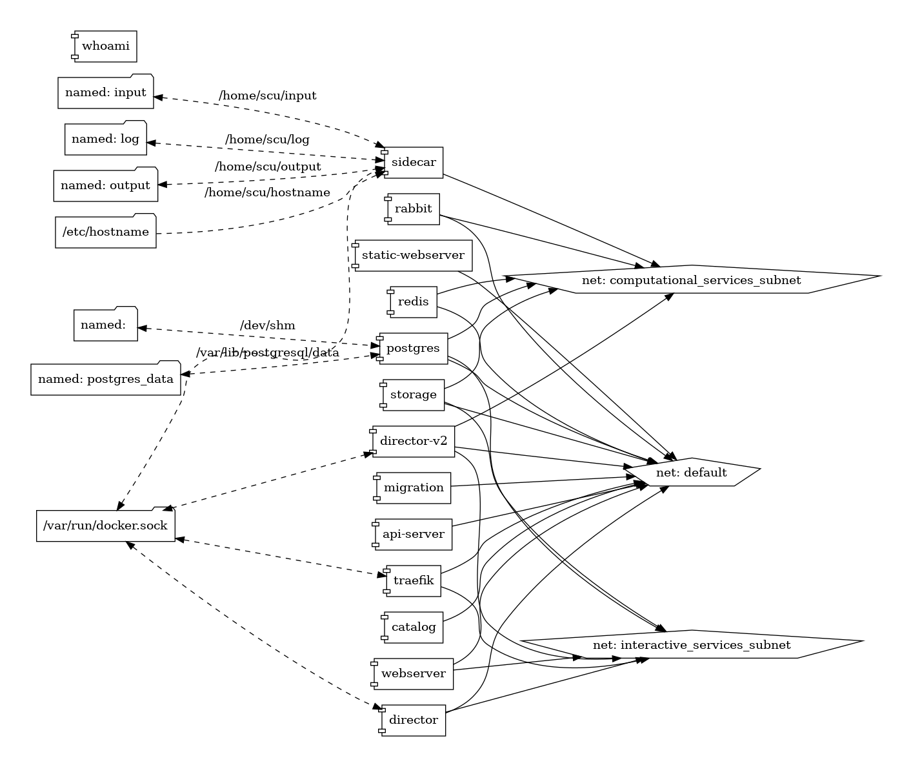

# simcore stack


```cmd
$ make .stack-simcore-version.yml
$ ./scripts/docker-compose-viz.bash .stack-simcore-version.yml
$ mv .stack-simcore-version.yml.png docs/img/
```




Diagrams of the [osparc-ops stacks](https://github.com/pcrespov/osparc-ops/blob/enh/documentation/docs/stacks-graph.md)

---

<sup>Updated Sep 12, 2019</sup>
<sup>Credits https://github.com/pmsipilot/docker-compose-viz</sup>
