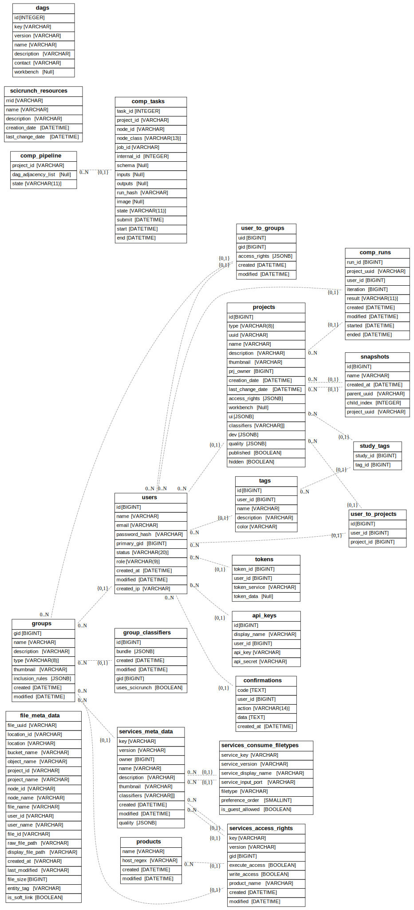

# Database Models


## Rationale

- Every table in the database is maintained by a given service
- This maintainer service shall have all helpers associated to that table (e.g. extension functions over raw metadata model)

- Isolate package with all table schemas per database and service
- Models shall not be implemented inheriting from Base. Use instead [explicit table definitions](https://docs.sqlalchemy.org/en/latest/orm/mapping_styles.html#classical-mappings)

## Entity Relationship Diagram (ERD)

Current models in ``simcore-postgres-database``:



To produce the diagram above

```bash
make devenv
source .venv/bin/activate

cd packages/postgres-database
make install-dev

cd scripts
uv pip install eralchemy
python create_erd.py
```
