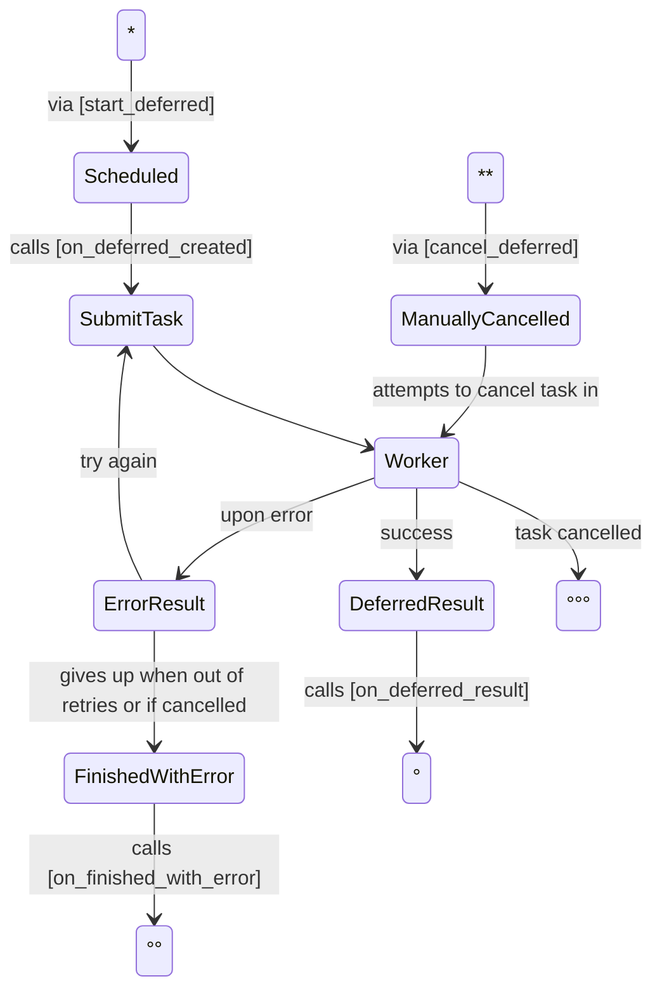

## DeferredHandler lifecycle

Methods executed

### States
- `Scheduled`: triggered by `start_deferred` and creates a TASK
- `SubmitTask`: decreases retry counter
- `Worker`: checks if slots are available (can refuse task), invokes `run_deferred` code and saves the result. Only state in which local state is used (to run the task).
- `ErrorResult`: checks if it can retry the gives up
- `FinishedWIthError`: logs error, invokes `on_finished_with_error` and removes the TASK
- `DeferredResult`: invokes `on_deferred_result` and removes the TASK
- `ManuallyCancelled`: cancels the task and removes the TASK- `ManuallyCancelled`: cancels the task and removes the TASK
