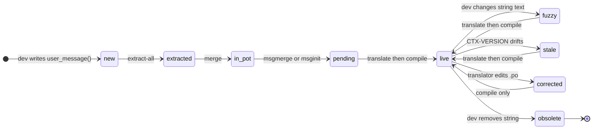
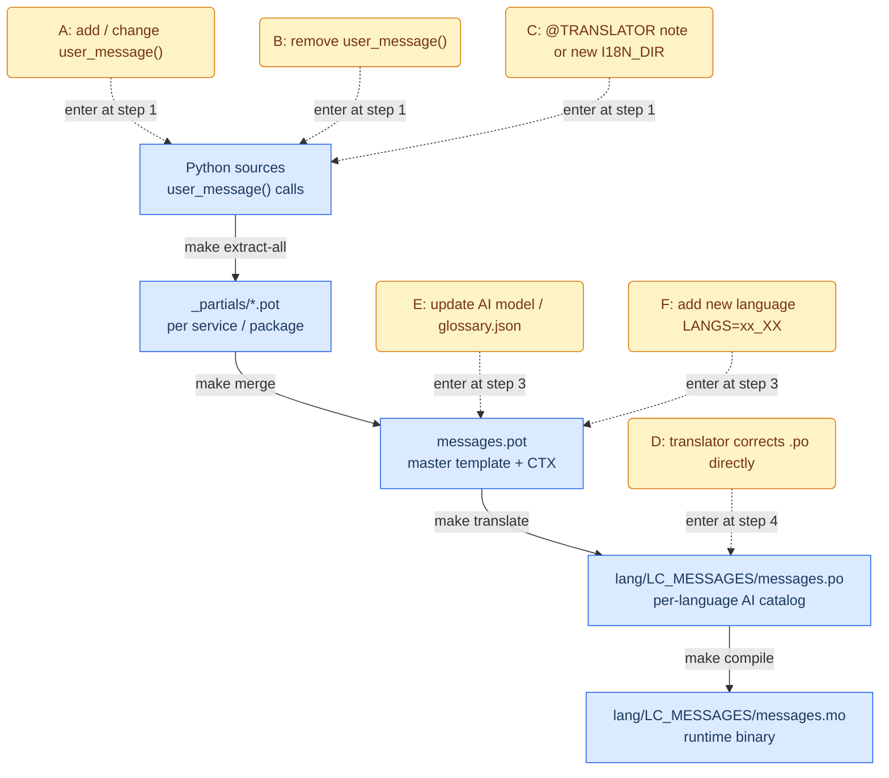
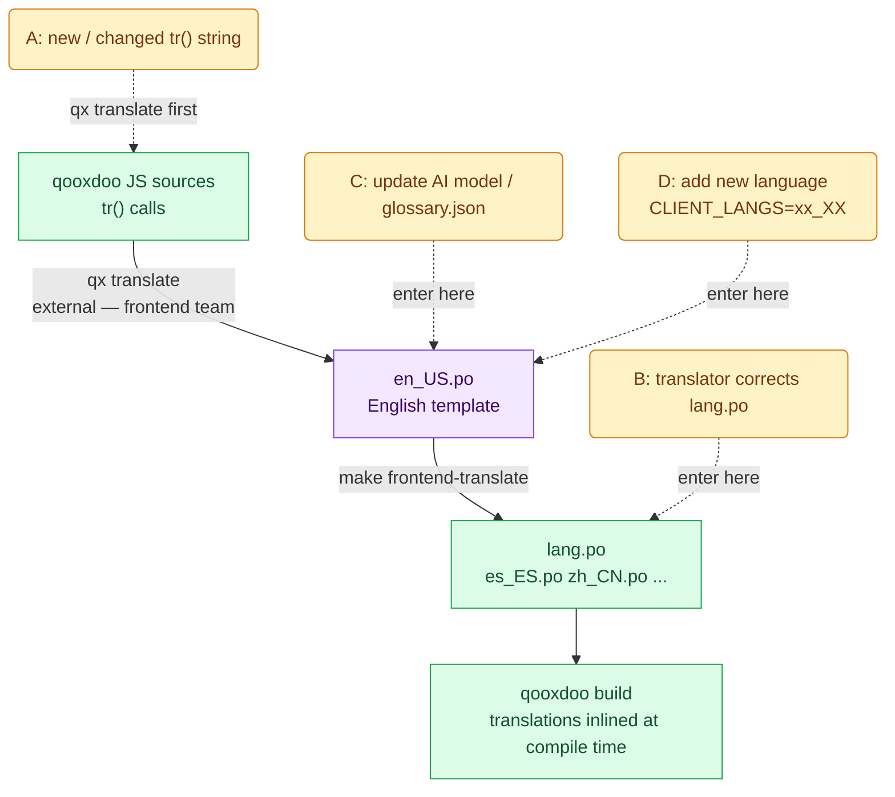

# i18n Pipeline — Design and Workflow Rationale

## First Principles

**The three-layer contract** is why the pipeline has exactly four stages:

1. **Template (`.pot`)** — always machine-generated from code; never hand-edited. Single source of truth for what translatable strings exist. Owned by developers.
2. **Catalog (`.po`)** — the translator's work surface. One file per language. Bridged to new template versions by `msgmerge`, which fuzzy-marks changed strings and marks deleted ones obsolete. Precious — never discard without `msgattrib --no-obsolete`.
3. **Binary (`.mo`)** — a throw-away lookup table compiled by `msgfmt`. Regenerated on demand from `.po`. Never commit manually; always derived.

**Why CTX?** Standard `fuzzy` only fires when the `msgid` string itself changed. But `"Internal error"` can appear in many different contexts; if surrounding code changes (refactor, new parameter, renamed variable), the string still needs re-evaluation even though the `msgid` is identical. The `enrich` step stores the git commit hash of the source line (`CTX-SNIPPET-VERSION`). If that hash changes between extraction runs, the entry is flagged stale and re-translated with fresh context — more precise than fuzzy matching alone.

**Why per-service partials?** Scoped extraction. Each service writes its own `_partials/service.pot`; `msgcat` merges them. You can re-scan one service without rescanning all `I18N_DIRS`.

**Why two separate catalogs?**

|              | Backend                                   | Frontend                                          |
| ------------ | ----------------------------------------- | ------------------------------------------------- |
| Strings      | `user_message()` in Python                | `tr()` in JS (qooxdoo)                            |
| Extraction   | `xgettext` + `i18n_extractor.py`          | `qx translate` (qooxdoo's own tool)               |
| Template     | `messages.pot`                            | `en_US.po`                                        |
| Runtime use  | `gettext()` at request time → needs `.mo` | Inlined at `qx compile` → `.po` consumed directly |
| Compile step | `msgfmt`                                  | None                                              |

The same AI translator (`i18n_translator.py`) runs for both; only the pipeline structure differs.

**Why a glossary?** Scientific domain terms ("mesh", "solver", "voxel") must translate consistently. Without it, the LLM may produce different renderings across calls. `glossary.json` pins canonical terms per locale.

---

## Entry Lifecycle

Every `msgid` in both catalogs follows this state machine. The three paths back to `live` from `fuzzy`, `stale`, and `corrected` are the entire maintenance cycle:

`fuzzy` — the `msgid` changed (detected by `msgmerge`).
`stale` — same `msgid`, but the surrounding source lines moved to a new commit (detected by CTX hash comparison inside `i18n_translator.py`).

---

## Backend Workflows

Pipeline output: `packages/common-library/src/common_library/locale/`

---

## Frontend Workflows

Pipeline output: `services/static-webserver/client/source/translation/`

`en_US.po` is shown in purple because it is **not produced by this Makefile** — it comes from qooxdoo's own extraction step. This Makefile only drives AI translation forward from that template.

---

## Quick Reference: Scenario → Make Targets

| Workflow | Trigger                                                                 | Make targets                                               | Note                                                                                                     |
| -------- | ----------------------------------------------------------------------- | ---------------------------------------------------------- | -------------------------------------------------------------------------------------------------------- |
| A        | dev adds / changes `user_message()`                                     | `make extract-all merge translate compile`                 | `make all` is equivalent                                                                                 |
| B        | dev removes `user_message()`                                            | `make extract-all merge compile`                           | `translate` is safe to skip — obsolete entries are excluded automatically                                |
| C        | dev adds `@TRANSLATOR` note in source, or adds a service to `I18N_DIRS` | `make extract-all merge translate compile`                 | note lands in `.pot` as `#.` comment; AI picks it up on next `translate`                                 |
| D        | translator directly edits a `.po` to fix a translation                  | `make compile`                                             | no extraction or AI step needed                                                                          |
| E        | update `glossary.json` or switch model                                  | `make translate compile MODEL=anthropic/claude-sonnet-4-6` | only stale/fuzzy/pending entries are re-translated; committed entries are skipped unless `USE_GIT=false` |
| F        | add a new language                                                      | `make translate compile LANGS=de_DE`                       | `msginit` creates the new `.po` from the existing `.pot`                                                 |
| G        | full initial setup or nuclear rebuild                                   | `make clean && make all`                                   |                                                                                                          |
| —        | frontend: string added (after `qx translate` updates `en_US.po`)        | `make frontend-translate`                                  |                                                                                                          |
| —        | frontend: add new language                                              | `make frontend-translate CLIENT_LANGS=de_DE`               |                                                                                                          |

`make check-i18n-style` is orthogonal — run it in CI to catch f-strings in `user_message()` calls before they silently break extraction.
