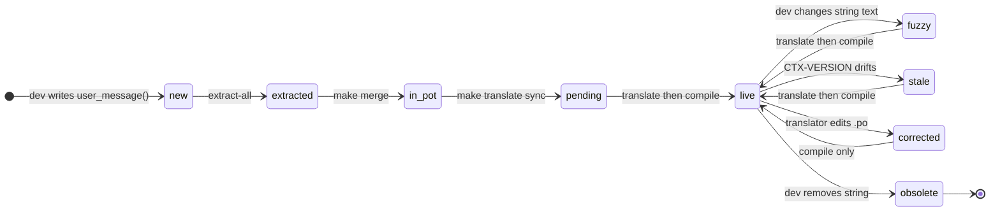
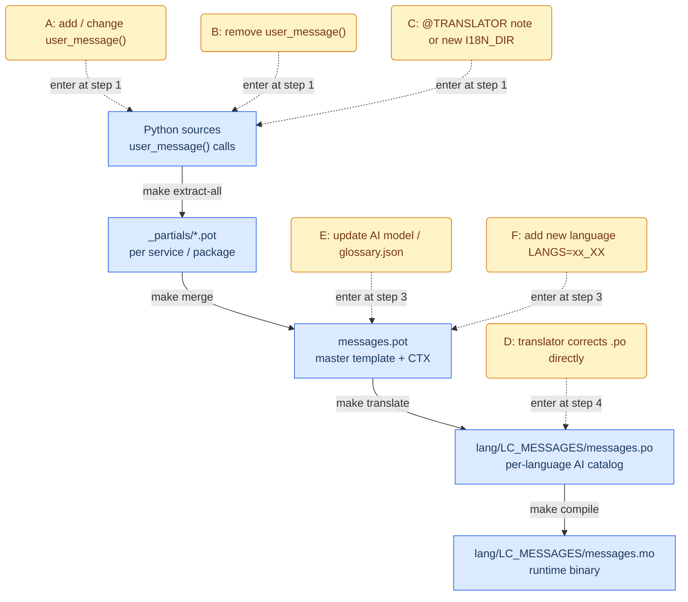
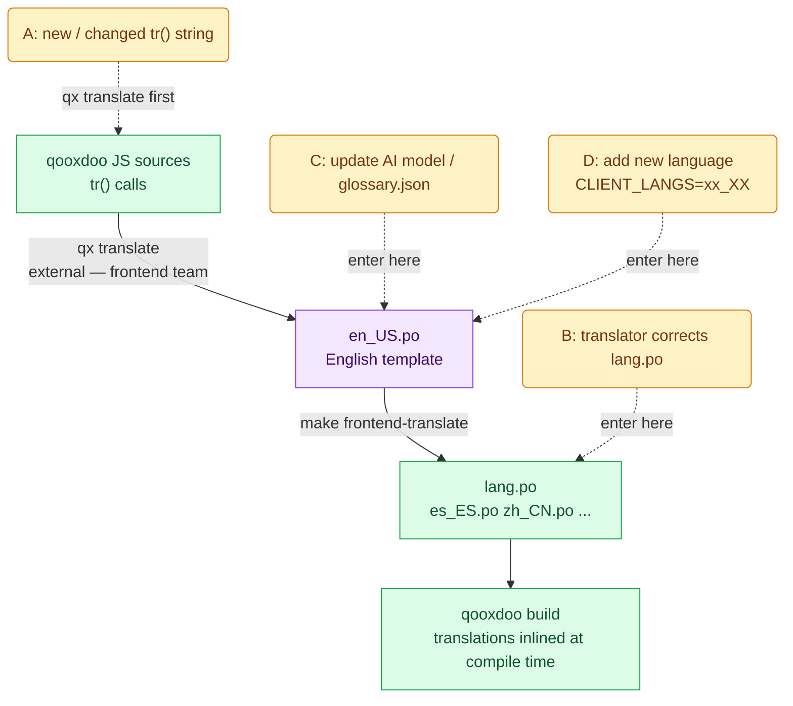

# i18n Pipeline — Design and Workflow Rationale

## What `scripts/i18n` Is For

`scripts/i18n` is the repository entry point for localization workflows. It orchestrates extraction, merge, AI-assisted translation, and compilation so backend and frontend catalogs stay consistent with source code changes.

Why this exists:
- Keep one repeatable pipeline instead of ad hoc per-service translation steps.
- Preserve translator intent in `.po` while regenerating derived artifacts deterministically.
- Make localization updates operable through a small set of make targets (`extract-all`, `merge`, `translate`, `compile`, `frontend-translate`). More details in [README.md](./README.md)

## First Principles Of The i18n Pipeline

This design is easiest to read in two complementary views:

1. **Artifact model (three layers)**
2. **Process model (four pipeline stages)**

The first view explains what files exist. The second explains how those files are created and maintained.

### Artifact Model (Three Layers)

1. **Template (`.pot`)** — always machine-generated from code; never hand-edited. It is developer-owned in the sense that code changes and extraction rules define it, not translator edits. It is the single source of truth for what translatable strings exist.
2. **Catalog (`.po`)** — the translator and reviewer work surface (human and AI). One file per language. It is kept in sync with template changes through the `translate` flow and can contain reviewed edits independent from source extraction.
3. **Binary (`.mo`)** — a compiled runtime lookup table built from `.po` for fast key lookup. It is generated by `compile` and compiled when installing `common-library`, where the locale catalog lives.

### Process Model (Four Pipeline Stages)

1. **Extract** (`make extract-all`) — scan `services/*` and `packages/*` source trees and generate per-scope partial templates.
2. **Merge** (`make merge`) — combine those partials into the master template; existing human edits in `.po` are carried forward during the next translate sync.
3. **Translate** (`make translate`) — update pending (new untranslated entries), fuzzy (source text changed), and stale (source context hash changed) entries.
4. **Compile** (`make compile`) — build runtime `.mo` files from `.po` catalogs.

### Version-Control Policy For Generated Artifacts

**Why `.pot` is not version-controlled**

The `.pot` template is generated output, not authored source. It is reproducible from the codebase and extraction rules, so committing it mostly adds churn and merge noise without adding authoritative intent. The source code and extraction logic are the canonical history.

**Why `.mo` is not version-controlled**

The `.mo` file is a compiled binary derived from `.po`. It is fully reproducible via `make compile`, opaque in diffs, and better treated as build output.

The operational rule is simple: version-control source and catalog intent (`.py`, `.js`, `.po`), then regenerate generated artifacts through make targets (`make extract-all`, `make merge`, `make translate`, `make compile`).

### `.po` Metadata (CTX)

#### What It Is

CTX is a source-context fingerprint added during `make merge` (the `enrich` step) as `CTX-SNIPPET-VERSION`.

#### Why It Exists

- This project mostly uses prose-as-key msgids (full user-facing English text as the key).
- `fuzzy` mostly captures text edits to `msgid`.
- Sometimes the text does not change, but its surrounding code meaning does.
- CTX detects that situation by comparing the stored snippet version with the current one.
- If the version changed, the entry is treated as `stale` and is re-evaluated in `make translate`.

Example `.po` entry with CTX comments:

```po
#, fuzzy
#: services/web/server/src/simcore_service_webserver/handlers/errors.py:73
#. CTX-SOURCE: services/web/server/src/simcore_service_webserver/handlers/errors.py:73
#. CTX-SNIPPET: raise web.HTTPInternalServerError(reason=user_message("Internal error"))
#. CTX-SNIPPET-VERSION: 7f3a9d4a
#. CTX-INTERPRETATION: Generic internal error shown to end users when request processing fails.
msgid "Internal error"
msgstr "Error interno"
```

Legend for markers shown above:
- `#, fuzzy` — gettext flag: translation needs review because source text changed or was auto-matched.
- `#:` — source location reference (`file:line`) where the string was extracted.
- `#.` — extracted translator comment. Here it carries `CTX-*` metadata.
- `#. CTX-*` — project-specific context comments (`CTX-SOURCE`, `CTX-SNIPPET`, `CTX-SNIPPET-VERSION`, `CTX-INTERPRETATION`) used to detect context drift.

Reference documentation for `.po` syntax and annotations:
- GNU gettext manual, PO file entries and comment types: https://www.gnu.org/software/gettext/manual/html_node/PO-File-Entries.html
- GNU gettext manual, workflow and fuzzy handling: https://www.gnu.org/software/gettext/manual/html_node/Workflow-flags.html

If that source snippet changes in a later commit (even with the same `msgid`), `make translate` can treat this entry as context-stale and refresh the translation/context.

### Why Per-Service Partials

Partials enable scoped extraction: each service writes `_partials/service.pot`, then `make merge` combines them into the master template. You can re-scan one service without rescanning all `I18N_DIRS`, which improves iteration speed and keeps extraction boundaries explicit.

### Why Two Separate Catalogs

|                | Backend                                   | Frontend                                          |
| -------------- | ----------------------------------------- | ------------------------------------------------- |
| Strings        | `user_message()` in Python                | `tr()` in JS (qooxdoo)                            |
| Extraction     | `xgettext` + `i18n_extractor.py`          | `qx translate` (qooxdoo's own tool)               |
| Auto-translate | `i18n_translator.py` (AI-assisted)        | `i18n_translator.py` (AI-assisted)                |
| Template       | `messages.pot`                            | `en_US.po`                                        |
| Runtime use    | `gettext()` at request time → needs `.mo` | Inlined at `qx compile` → `.po` consumed directly |
| Compile step   | `msgfmt`                                  | None                                              |

The same AI translator (`i18n_translator.py`) runs for both; only the pipeline structure differs.

### Why A Glossary

Scientific domain terms ("mesh", "solver", "voxel") must translate consistently. Without it, the LLM may produce different renderings across calls. `glossary.json` pins canonical terms per locale.

---

## Entry Lifecycle

Every `msgid` in both catalogs follows this state machine. The three paths back to `live` from `fuzzy`, `stale`, and `corrected` are the entire maintenance cycle:



`fuzzy` — the `msgid` changed (detected during the catalog sync step in `make translate`).
`stale` — same `msgid`, but the surrounding source lines moved to a new commit (detected by CTX hash comparison inside `i18n_translator.py`).

---

## Backend Workflows

Pipeline output: `packages/common-library/src/common_library/locale/`



---

## Frontend Workflows

Pipeline output: `services/static-webserver/client/source/translation/`



`en_US.po` is shown in purple because it is **not produced by this Makefile** — it comes from qooxdoo's own extraction step. This Makefile only drives AI translation forward from that template.

---

## Quick Reference: Scenario → Make Targets

| Workflow | Trigger                                                                 | Make targets                                               | Note                                                                                                     |
| -------- | ----------------------------------------------------------------------- | ---------------------------------------------------------- | -------------------------------------------------------------------------------------------------------- |
| A        | dev adds / changes `user_message()`                                     | `make extract-all merge translate compile`                 | `make all` is equivalent                                                                                 |
| B        | dev removes `user_message()`                                            | `make extract-all merge compile`                           | `translate` is safe to skip — obsolete entries are excluded automatically                                |
| C        | dev adds `@TRANSLATOR` note in source, or adds a service to `I18N_DIRS` | `make extract-all merge translate compile`                 | note lands in `.pot` as `#.` comment; AI picks it up on next `translate`                                 |
| D        | translator directly edits a `.po` to fix a translation                  | `make compile`                                             | no extraction or AI step needed                                                                          |
| E        | update `glossary.json` or switch model                                  | `make translate compile MODEL=anthropic/claude-sonnet-4-6` | only stale/fuzzy/pending entries are re-translated; committed entries are skipped unless `USE_GIT=false` |
| F        | add a new language                                                      | `make translate compile LANGS=de_DE`                       | `msginit` creates the new `.po` from the existing `.pot`                                                 |
| G        | full initial setup or nuclear rebuild                                   | `make clean && make all`                                   |                                                                                                          |
| —        | frontend: string added (after `qx translate` updates `en_US.po`)        | `make frontend-translate`                                  |                                                                                                          |
| —        | frontend: add new language                                              | `make frontend-translate CLIENT_LANGS=de_DE`               |                                                                                                          |

`make check-i18n-style` is orthogonal — run it in CI to catch f-strings in `user_message()` calls before they silently break extraction.
