# api-server

Platform's public API server

## Development

Since the API server communicates with (almost) all other services, running it requires running the entire osparc (see the section [development build](../../README.md#development-build) of the main README)

Open the following sites and use the test credentials user=key, password=secret to manually test the API:

    http://127.0.0.1.nip.io:8006/dev/doc: swagger type of documentation

### Profiling requests to the api server
When in development mode (the environment variable `API_SERVER_DEV_FEATURES_ENABLED` is =1 in the running container) one can profile calls to the API server directly from the client side. On the server, the profiling is done using [Pyinstrument](https://github.com/joerick/pyinstrument). If we have our request in the form of a curl command, one simply adds the custom header `x-profile-api-server:true` to the command, in which case the profile is received under the `profile` key of the response body. This makes it easy to visualise the profiling report directly in bash:
```bash
<curl_command> -H 'x-profile-api-server: true' | jq -r .profile
```

## Clients

- Python client for osparc-simcore API can be found in https://github.com/ITISFoundation/osparc-simcore-client)


## Backwards compatibility of the server API
The public API is required to be backwards compatible in the sense that a [client](https://github.com/ITISFoundation/osparc-simcore-clients) which is compatible with API version `N` should also be compatible with version `N+1`. Because of this, upgrading the server should never force a user to upgrade their client: The client which they have is already compatible with the new server.

```mermaid

flowchart LR
  subgraph Client
    direction LR
    A2(dev branch) .->|"🔙"| B2(master) .->|"🔙"| C2(staging) .->|"🔙"| D2(production)
    A2(dev branch) ==>|"🔨"| B2(master) ==>|"🔨"| C2(staging) ==>|"🔨"| D2(production)
  end
  subgraph Server
    direction LR
    A1(dev branch) ~~~ B1(master) ~~~ C1(staging) ~~~ D1(production)
    A1(dev branch) ==>|"🔨"| B1(master) ==>|"🔨"| C1(staging) ==>|"🔨"| D1(production)
  end

  A1 .->|"🔙"| A2
  B1 .->|"🔙"| B2
  C1 .->|"🔙"| C2
  D1 .->|"🔙"| D2

  A2 ~~~ A1
  B2 ~~~ B1
  C2 ~~~ C1
  D2 ~~~ D1
```



In this diagram the development workflow/progress is indicated with 🔨-arrows both for the server client. To see which client version a given server version is compatible with one can follow the backwards 🔙-arrows from that server version. E.g. one sees that the server in `staging` is compatible with the client in `staging` and in `production`. Needless to say, to see which versions of the server a given client is compatible with one can follow the dotted lines backwards from the client version. E.g. the client in `master` is seen to be compatible with ther server versions in `master` and in `dev branch`.

## References

- [Design patterns for modern web APIs](https://blog.feathersjs.com/design-patterns-for-modern-web-apis-1f046635215) by D. Luecke
- [API Design Guide](https://cloud.google.com/apis/design/) by Google Cloud


## Acknowledgments

  Many of the ideas in this design were taken from the **excellent** work at https://github.com/nsidnev/fastapi-realworld-example-app by *Nik Sidnev* using the **extraordinary** [fastapi](https://fastapi.tiangolo.com/) package by *Sebastian Ramirez*.
