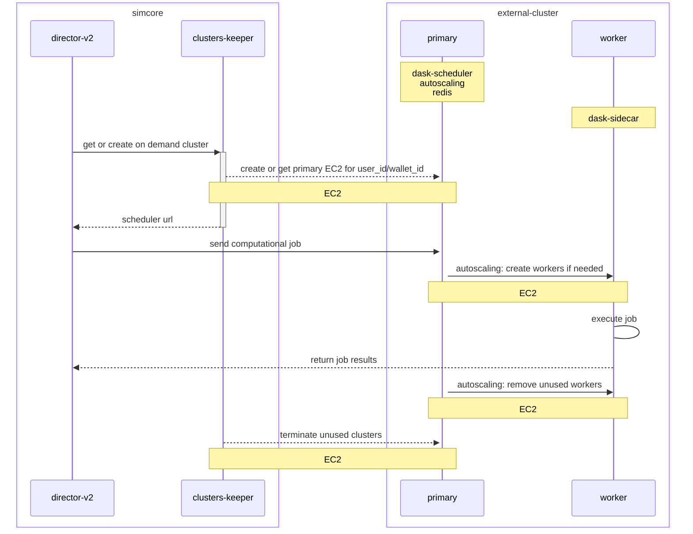

# clusters-keeper

Service to automatically create computational clusters

```mermaid

sequenceDiagram
    box simcore
    participant director-v2
    participant clusters-keeper
    end
    box external-cluster
    participant primary
    participant worker
    end
    Note over primary: dask-scheduler<br/>autoscaling<br/>redis
    Note over worker: dask-sidecar
    director-v2->>+clusters-keeper: get or create on demand cluster
    clusters-keeper-->>+primary: create or get primary EC2 for user_id/wallet_id
    Note over clusters-keeper,primary: EC2
    clusters-keeper-->>-director-v2: scheduler url

    director-v2->>+primary: send computational job
    primary->>worker: autoscaling: create workers if needed
    Note over primary,worker: EC2
    worker->worker: execute job
    worker-->>director-v2: return job results
    primary->>worker: autoscaling: remove unused workers
    Note over primary,worker: EC2

    clusters-keeper-->>primary: terminate unused clusters
    Note over clusters-keeper,primary: EC2


```
