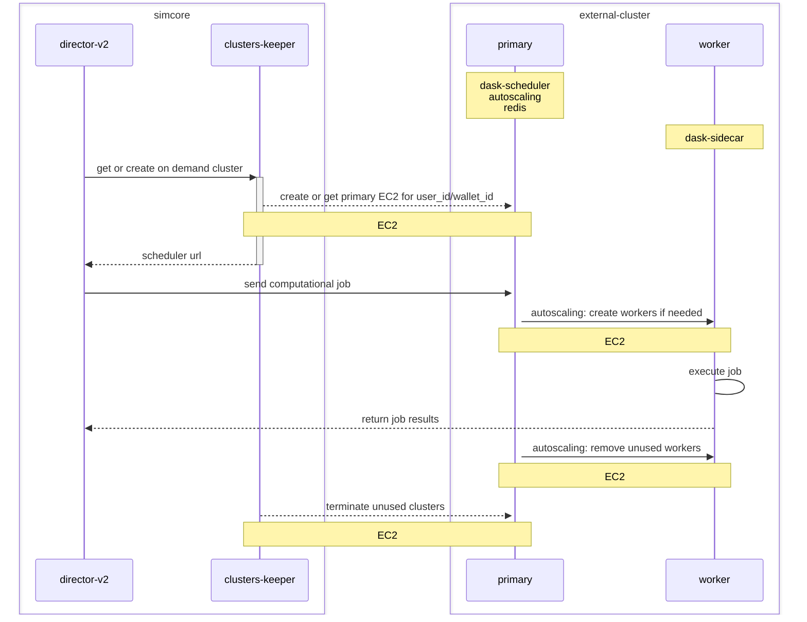

# clusters-keeper

Service to automatically create computational clusters

## memory profiling with memray

Opt-in [memray](https://bloomberg.github.io/memray/) wrapper around uvicorn in
`docker/boot.sh` (development image only) — see the
[shared runbook](../README.md#memory-profiling-with-memray) for the full how-to.

- variables: `CLUSTERS_KEEPER_MEMRAY_*` (master switch `CLUSTERS_KEEPER_MEMRAY_ENABLED`, `live` mode by default, live port `10252`)
- viewer: `docker exec -it "$(docker compose ps -q clusters-keeper)" memray live 10252`
