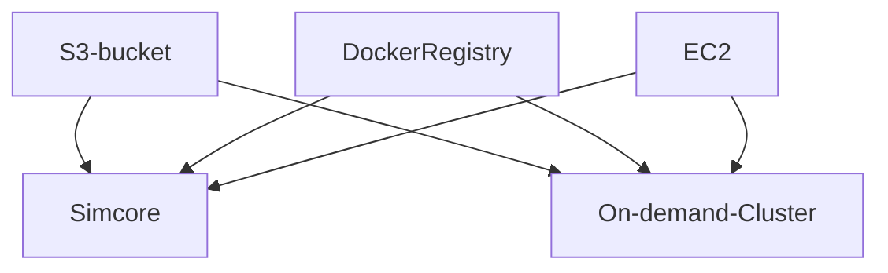

# clusters-keeper manual testing

This describes how a setup to manually test a local simcore deployment against AWS using the clusters-keeper and the external on-demand clusters.

## architecture

In order for local testing to work (e.g. locally deployed osparc-simcore with external clusters):
- the same AWS S3 bucket must be accessible from both simcore/cluster,
- the same Docker registry accessible from both simcore/cluster,
- the same AWS EC2 must be accessible from both simcore/cluster.



## requirements
1. AWS S3 access
2. AWS EC2 access


## instructions

1. build simcore
```bash
git clone https://github.com/ITISFoundation/osparc-simcore.git
cd osparc-simcore
make .env # generate initial .env file
make build-devel # build for development mode or
make build # for production mode
```

2. prepare docker registry (it **must** be accessible from both simcore/cluster), edit .env file and change the following ENVs:
```bash
REGISTRY_AUTH=True
REGISTRY_PW=XXXXXXX
REGISTRY_SSL=True
REGISTRY_URL=XXXXXXX
REGISTRY_USER=XXXXXXX
```

3. prepare S3 access in AWS, a dedicated accessible bucket is required:
```bash
S3_ACCESS_KEY=XXXXXXX
S3_BUCKET_NAME=XXXXXXX
S3_ENDPOINT=https://s3.amazonaws.com
S3_SECRET_KEY=XXXXXXX
```

4. prepare clusters-keeper:
```bash
CLUSTERS_KEEPER_EC2_ACCESS={}
CLUSTERS_KEEPER_EC2_ACCESS_KEY_ID=XXXXXXX
CLUSTERS_KEEPER_EC2_ENDPOINT=https://ec2.amazonaws.com
CLUSTERS_KEEPER_EC2_REGION_NAME=us-east-1
CLUSTERS_KEEPER_EC2_SECRET_ACCESS_KEY=XXXXXXX

CLUSTERS_KEEPER_PRIMARY_EC2_INSTANCES={}
PRIMARY_EC2_INSTANCES_ALLOWED_TYPES='{"t2.medium":"ami_id": "XXXXXXXX", "custom_boot_scripts": ["whoami"]}}'
PRIMARY_EC2_INSTANCES_KEY_NAME=XXXXXXX
PRIMARY_EC2_INSTANCES_MAX_INSTANCES=10
PRIMARY_EC2_INSTANCES_SECURITY_GROUP_IDS="[\"XXXXXXX\"]"
PRIMARY_EC2_INSTANCES_SUBNET_ID=XXXXXXX

CLUSTERS_KEEPER_WORKERS_EC2_INSTANCES={}
WORKERS_EC2_INSTANCES_ALLOWED_TYPES='{"g4dn.xlarge": {"ami_id": "XXXXXXXX", "custom_boot_scripts": ["whoami"], "pre_pull_images": ["ubuntu:latest"]}}'
WORKERS_EC2_INSTANCES_KEY_NAME=XXXXXXX
WORKERS_EC2_INSTANCES_MAX_INSTANCES=10
WORKERS_EC2_INSTANCES_SECURITY_GROUP_IDS="[\"XXXXXXX\"]"
WORKERS_EC2_INSTANCES_SUBNET_ID=XXXXXXX
WORKERS_EC2_INSTANCES_TIME_BEFORE_DRAINING="00:00:20"
WORKERS_EC2_INSTANCES_TIME_BEFORE_TERMINATION="00:03:00"
WORKERS_EC2_INSTANCES_CUSTOM_TAGS='{"osparc-tag": "some fun tag value"}'
```

4. prepare dask TLS certificates
NOTE: the dask TLS certificates are in AWS and shall be copied into the local stack such that the director-v2 can access the clusters
these are defined by PRIMARY_EC2_INSTANCES_SSM_TLS_DASK_CA, PRIMARY_EC2_INSTANCES_SSM_TLS_DASK_CERT and PRIMARY_EC2_INSTANCES_SSM_TLS_DASK_KEY
  1. one need to go to the AWS Parameter Store (SSM)
  2. find these entries then copy their contents into respectively services/dask-sidecar/.dask-certificates/dask-cert.pem and services/dask-sidecar/.dask-certificates/dask-key.pem


5. start osparc
```bash
make up-devel # for devel mode
make up-prod # for prod mode
```
