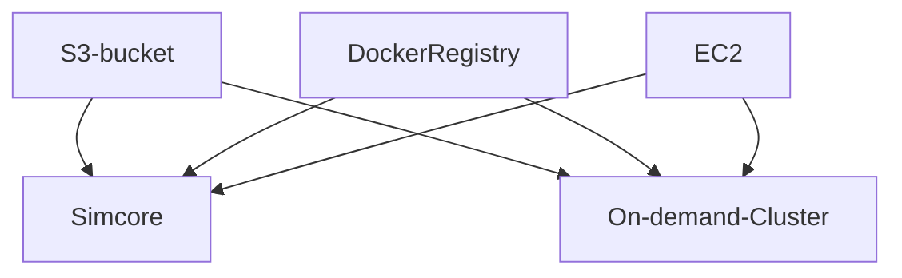

# clusters-keeper manual testing

This describes how a setup to manually test a local simcore deployment against AWS using the clusters-keeper and the external on-demand clusters.

## architecture

In order for local testing to work (e.g. locally deployed osparc-simcore with external clusters):
- the same AWS S3 bucket must be accessible from both simcore/cluster,
- the same Docker registry accessible from both simcore/cluster,
- the same AWS EC2 must be accessible from both simcore/cluster.



## requirements
1. AWS S3 access
2. AWS EC2 access


## instructions

1. build simcore
```bash
git clone https://github.com/ITISFoundation/osparc-simcore.git
make .env # generate initial .env file
make build-devel # build for development mode or
make build # for production mode
```

2. prepare docker registry (it **must** be accessible from both simcore/cluster), edit .env file and change the following ENVs:
```bash
REGISTRY_AUTH=True
REGISTRY_PW=XXXXXXX
REGISTRY_SSL=True
REGISTRY_URL=XXXXXXX
REGISTRY_USER=XXXXXXX
```

3. prepare S3 access in AWS, a dedicated accessible bucket is required:
```bash
S3_ACCESS_KEY=XXXXXXX
S3_BUCKET_NAME=XXXXXXX
S3_ENDPOINT=s3.amazonaws.com
S3_SECRET_KEY=XXXXXXX
S3_SECURE=1
```

4. prepare clusters-keeper:
```bash
EC2_CLUSTERS_KEEPER_ACCESS_KEY_ID=XXXXXXX
EC2_CLUSTERS_KEEPER_ENDPOINT=https://ec2.amazonaws.com
PRIMARY_EC2_INSTANCES_ALLOWED_TYPES="[\"t2.micro\"]"
PRIMARY_EC2_INSTANCES_AMI_ID=XXXXXXX
PRIMARY_EC2_INSTANCES_KEY_NAME=XXXXXXX
PRIMARY_EC2_INSTANCES_SECURITY_GROUP_IDS="[\"XXXXXXX\"]"
PRIMARY_EC2_INSTANCES_SUBNET_ID=XXXXXXX
EC2_CLUSTERS_KEEPER_REGION_NAME=us-east-1
EC2_CLUSTERS_KEEPER_SECRET_ACCESS_KEY=XXXXXXX
CLUSTERS_KEEPER_MAX_MISSED_HEARTBEATS_BEFORE_CLUSTER_TERMINATION=5
CLUSTERS_KEEPER_TASK_INTERVAL=30

CLUSTERS_KEEPER_WORKERS_EC2_ENDPOINT=https://ec2.amazonaws.com
WORKERS_EC2_INSTANCES_ALLOWED_TYPES="[\"t2.large\"]"
WORKERS_EC2_INSTANCES_AMI_ID=XXXXXXX
WORKERS_EC2_INSTANCES_KEY_NAME=XXXXXXX
WORKERS_EC2_INSTANCES_SECURITY_GROUP_IDS="[\"XXXXXXX\"]"
WORKERS_EC2_INSTANCES_SUBNET_ID=XXXXXXX
CLUSTERS_KEEPER_WORKERS_EC2_REGION_NAME=us-east-1
CLUSTERS_KEEPER_WORKERS_EC2_SECRET_ACCESS_KEY=XXXXXXX
```

5. start osparc
```bash
make up-devel # for devel mode
make up-prod # for prod mode
```
