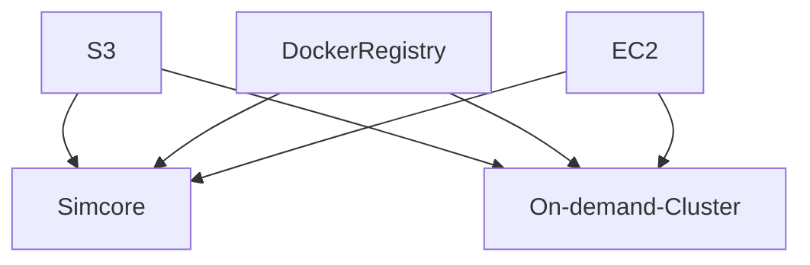

# clusters-keeper manual testing

This describes how a setup to manually test a local simcore deployment against AWS using the clusters-keeper and the external on-demand clusters.

## architecture

## requirements

1. AWS EC2 access from both local simcore and on-demand cluster
2. AWS S3 access from both local simcore and on-demand cluster
3. Docker registry access from both local simcore and on-demand cluster
