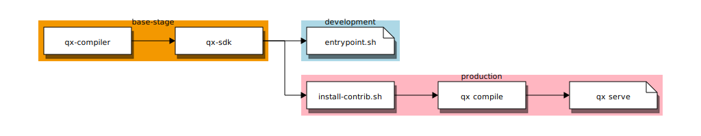

# web/client

This is the front-end (client-side) application of the osparc-simcore platform.

## [qooxdoo] compiler

This source code needs to be *compiled* using [qooxdoo] and the output is the code served by the web server.

All [qooxdoo] tooling and configurations are containerized and can be found under [tools](services/web/client/tools) folder

Compiling in container and serving to http://127.0.0.1:8080

    $ make help
    $ make compile
    $ make serve

> Due to **limitations of docker on a Windows** host, a workaround is needed to enabling watching [qooxdoo] source code. The [docker-windows-volume-watcher](https://github.com/merofeev/docker-windows-volume-watcher) tool will notify Docker containers about changes in mounts on Windows. For convenience we provide a script in ``osparc-simcore/scripts/win-watcher.bat``.

## [qooxdoo] server

[qooxdoo] also comes with a static server that can be handy to view the UI when no backend is required

    $ qx serve --set qx.allowUrlSettings=true

where

- ``dev.enableFakeSrv: true/[false]`` : enables/disables fake server. Used exclusively for development.
- ``dev.disableLogin:  true/[false]``  : enables/disables login page. Used exclusively for development.

Examples:

- http://127.0.0.1:8080/
- http://127.0.0.1:8080/index.html?qxenv:dev.enableFakeSrv:true
- http://127.0.0.1:8080/index.html?qxenv:dev.enableFakeSrv:true&qxenv:dev.disableLogin:true

For demo purposes, the user/pass to login when the fake server is active is ```bizzy@itis.ethz.ch``` and ```z43```, respectively.

## Frontend UI Workflow


---

## Build/Run Services

  $ make help

>DEPRECATED
>
>This project uses a multi-stage ``Dockerfile`` that targets images for *development*
>and *production*, respectively. In this context, a *development* container mounts
>``client`` folder and reacts to source code changes. On the the hand, the
>*production* container copies ``client`` folder inside instead. The latter is intended as a intermediate stage for the ``web/server`` container. This is how the ``Dockerfile`` is split:
>[](http://interactive.blockdiag.com/image?compression=deflate&encoding=base64&src=eJx9kMFuwyAMhu99Cot79gJRd-h5h92rHkhiJSgupkCiVlPfvQYyiU5rkUDYv_g__3TE_TwYPcLPDkChjf7m2Nj4ESYFxzBph3vLEU9JvlwhoF_xj7KD0fPisgXpDgn2oDodsAlRj6ha6UPaYtD0fHaG0Ks2l2GYlUj32gMqG-d5WPpo2BYbWT0T-6R9mXGK38bOIm2aMlaYRIKRKKZLMTIINu5WlRjp0UvygCsSu7P8yQv0gRas0M-fV7zlrDJD8wklc7r9N2vuV9P-1mXe9q3dMz_PdX8APQWRAQ)

### Limitiations running in a Windows host

**Development version of image doesn't work on a windows host**. Modified files in the mounted volume don't trigger container operating  system notifications, so watchers don't react to changes. This is a known limitation of docker on windows. A [workaround](http://blog.subjectify.us/miscellaneous/2017/04/24/docker-for-windows-watch-bindings.html) is possible. Open terminal in windows host and type:

```bash
pip install docker-windows-volume-watcher
docker-volume-watcher
```

**NOTE** Use scripts in [osparc-simcore/scripts/win-watcher.bat](../../../scripts/win-watcher.bat)

<!-- ADD REFERENCES ALPHABETICALLY BELOW THIS LINE -->
[qooxdoo]:http://www.qooxdoo.org/
