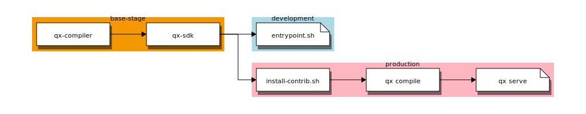

# web/client

``qxapp`` is the main client-side application of the sim-core platform.

To ease development of the client, we have encapsulated the [qx]-compiler and all setup needed to run the client in a container. This way, we can develop the
client without connecting to the final server but instead emulating it.

The docker-compose files in this directory help running ``qxapp`` stand-alone using a dev server in [qx]. This is a common workflow:

```bash
cd path/to/web/client

# build images 'client_qx:dev'
docker-compose build

# installs theme and fires qx serve. Open http://localhost:8080/
docker-compose up

# open a new console, and type this to stop
cd path/to/web/client
docker-compose down
```

## docker

This project uses a multi-stage ``Dockerfile`` that targets images for *development*
and *production*, respectively. In this context, a *development* container mounts
``client`` folder and reacts to source code changes. On the the hand, the
*production* container copies ``client`` folder inside instead. The latter is intended as a intermediate stage for the ``web/server`` container. This is how the ``Dockerfile`` is split:

[](http://interactive.blockdiag.com/image?compression=deflate&encoding=base64&src=eJx9kMFuwyAMhu99Cot79gJRd-h5h92rHkhiJSgupkCiVlPfvQYyiU5rkUDYv_g__3TE_TwYPcLPDkChjf7m2Nj4ESYFxzBph3vLEU9JvlwhoF_xj7KD0fPisgXpDgn2oDodsAlRj6ha6UPaYtD0fHaG0Ks2l2GYlUj32gMqG-d5WPpo2BYbWT0T-6R9mXGK38bOIm2aMlaYRIKRKKZLMTIINu5WlRjp0UvygCsSu7P8yQv0gRas0M-fV7zlrDJD8wklc7r9N2vuV9P-1mXe9q3dMz_PdX8APQWRAQ)

In order to build/run each target image, we override ``docker-compose`` configuration files: ``docker-compose.yml`` and ``docker-compose.production.yml``

```bash
cd path/to/web/client

# build images 'client_qx:dev'
docker-compose -f docker-compose.yml -f docker-compose.production.yml build

# Runs production. Open http://localhost:8080/
docker-compose -f docker-compose.yml -f docker-compose.production.yml up

# open a new console, and type this to stop
cd path/to/web/client
docker-compose down
```

TODO: update doc below

```bash
# builds both production & development images
docker-compose run qx-prod

docker-compose run qx --help

# compiles code and recompiles as sources changes
docker-compose run qx compile --watch

docker-compose run qx lint

docker-compose run qx clean

# removes all containers created previously
docker-compose down
```

[qx]:http://www.qooxdoo.org/
